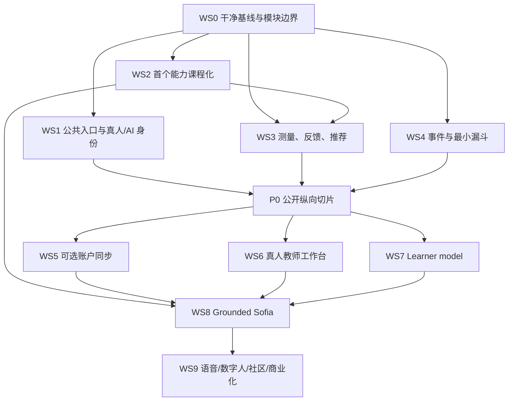

# Sufeiya 智能学习平台后续开发计划

> - 来源 Codex session：`01a01886-bd21-7312-a194-155beec8bf97`
> - Session 标题：`评估Sufeiya学习网站缺口`
> - 整理日期：`2026-08-19`
> - 文档状态：`IMPLEMENTATION PLAN / NOT IMPLEMENTATION OR RELEASE EVIDENCE`
> - 真实网站仓库：`/Volumes/WestWorld/Sufeiya/website`
> - 实施工作树：`/Volumes/WestWorld/Sufeiya/worktrees/learning-platform-next-20260819`
> - 实施分支：`codex/learning-platform-next-20260819`
> - 基线：`origin/main@bf7cac8b3163ed5c00c5bc57607b63266ff22b21`

## 0. 文档用途与证据边界

本文件把来源 session 中 Codex 的网站审计、产品建议和工程提醒整理为下一阶段可执行的开发计划。它用于确定顺序、范围、依赖、验收标准和风险边界，不代表任何功能已经实现、教师已经验收、GitHub 已经更新、Preview 已经通过或生产网站已经发布。

执行本计划时，所有状态必须按证据分层记录：

1. 源码实现；
2. 静态检查、单元测试和构建；
3. 真实浏览器与可访问性验证；
4. 教学内容和测量审核；
5. 苏肥鸭老师/真人教师验收；
6. Preview 候选；
7. 授权人的公开发布决定；
8. 生产部署与线上回归。

任何一层的 `PASS` 只证明该层，不能自动证明其他层通过。

## 1. 一页结论

Sufeiya 当前不是“完全不能学习”的媒体站，而是：

> **成熟的品牌/媒体前台 + 邀请制、浏览器本地的 Gate A 学习原型。**

公开访客目前主要能阅读方法说明、浏览课程元数据并跳转外部视频；真正的交互学习位于登录与邀请资格之后。因此，下一阶段的首要目标不是扩大 AI、语音或数字人能力，也不是重写全站，而是让新访客在公开环境中马上完成一次真实、低风险、有反馈的学习行为。

### 北极星目标

让首次访问者：

1. 无需登录；
2. 在两次点击内开始；
3. 在五分钟内完成一个真实学习任务；
4. 获得一条具体、可解释、可行动的反馈；
5. 得到一个明确的下一步；
6. 能查看、导出和删除本次保存在本机的学习记录；
7. 在已经获得价值之后，再选择后续方式：本机继续/导出、受邀内测登录、加入等候名单；只有公开注册 Gate 通过后，才显示公开注册并保存学习计划。

### 推荐建设顺序

```text
P0：公开、learner-first 的单能力完整纵向切片
  ↓
P1：账户连续性 + 课程 CMS + 真人教师工作台 + learner model
  ↓
P1/P2：有来源、会拒答、会转人工的 Grounded Sofia
  ↓
P2：语音、数字人、真实社区、商业化与机构能力
```

## 2. 当前基线

### 2.1 Git 与工作树基线

来源 session 已经完成安全开发基线隔离：

| 项目 | 状态 |
|---|---|
| 新实施工作树 | `/Volumes/WestWorld/Sufeiya/worktrees/learning-platform-next-20260819` |
| 新实施分支 | `codex/learning-platform-next-20260819` |
| 基线提交 | `bf7cac8b3163ed5c00c5bc57607b63266ff22b21` |
| 上游 | `origin/main` |
| 建立时 ahead / behind | `0 / 0` |
| 建立时 Git 状态 | 干净；本计划文件是该分支的第一项计划内新增 |
| 建立时 `git diff --check` | 通过 |
| 业务代码、提交、推送、部署 | 均未发生 |

原工作树 `/Volumes/WestWorld/Sufeiya/website` 保持原样：它位于旧分支 `codex/next-clerk-launch-20260809`，相对 `origin/main` 落后 33 个提交，并保留未提交的 Analytics 相关修改。不得擅自暂存、stash、重置、清理、覆盖或批量复制这些用户改动。

另有并行工作树 `/Volumes/WestWorld/Sufeiya/worktrees/typed-learning-modules-20260819`。它不属于本计划文件的修改范围；后续如需整合其成果，必须逐提交审阅、确认模块边界与测试证据，不能盲目合并或覆盖本分支。

### 2.2 产品审计快照

以下数字来自 2026-08-19 的来源 session 审计。它们用于说明计划起点；进入任何发布 Gate 前，都必须从当前代码、Preview、线上接口与真实浏览器重新核验，不能把本表当作持续有效的现状证明。

| 能力层 | Session 审计状态 | 对计划的含义 |
|---|---|---|
| 品牌与媒体层 | 已上线，完成度较高 | 不作为 P0 重写对象 |
| 公开学习入口 | 主要 CTA 进入登录/邀请核验 | P0 首要缺口 |
| 公开资源 | 16 条课程元数据，主要外跳 Bilibili | 需要课程化，而不是继续堆链接 |
| Gate A 内容 | 6 个诊断任务、4 个英文微练习 | 可验证流程，不能支撑长期学习 |
| 学习记录 | 当前浏览器本机存储 | P0 可继续本机优先；账户同步后置 |
| 反馈 | 客观题偏判对错；开放题偏自查 | P0 必须补可行动反馈 |
| 推荐 | 确定性规则与固定路由 | 暂不称为 adaptive learning |
| Sofia | 外部模型、学生数据上云、模型生成关闭 | 保持 fail-closed，P1/P2 再评估 |
| 内容治理 | 15 条登记；教师审核 0；RAG 准入 0 | AI 上线前必须形成准入内容 |
| 正式 P0 决定 | `0/29 resolved` | 阻塞高风险远端能力 |
| 真人教师运营 | 本机演示，无正式队列/RBAC | P1 工作流 |
| 产品/学习分析 | 尚无已证实的生产闭环 | P0 先做最小事件与漏斗 |

## 3. 不可违反的实施原则

1. **学习价值先于注册。** 用户先获得一次真实反馈，再邀请建立账户。
2. **课程知识先于生成式 AI。** 先完成可教、可练、可反馈、可复测的内容，再开放模型。
3. **证据不冒充分数。** 教研和测量审核完成前，只使用“3 分钟入门检查”“学习证据初筛”“找出今天优先练习方向”等表述。
4. **本机优先、同步可选。** 匿名试学默认本机；只有在用户明确同意后才绑定账户和跨设备同步。
5. **真人教师与 AI 始终可区分。**
   - `苏肥鸭老师`：真人教师、教研负责人、课程内容主理人与人工支持；
   - `Sofia 智能老师`：AI 学习助手；
   - 真人照片不得作为 AI 聊天头像；
   - AI 页面、头像、声音和对话持续显示 `AI` 标识。
6. **所有高风险能力 fail-closed。** 治理、数据流、授权、删除、地域、预算、责任与评测未通过时，远端模型、语音、数字人和真实社区保持关闭。
7. **渐进拆分，不做全站重写。** 通过现有边界测试逐步把课程、测评、反馈、推荐、事件和 UI 状态拆成类型化模块。
8. **技术 PASS、教师验收与发布决定分离。** Build、HTTP 200、截图或 Preview 都不等于公开发布或真人教师接受。
9. **数据最小化。** 产品漏斗、学习证据与未来 AI 安全记录分别建模；事件默认不得包含开放题原文、录音、身份信息或不必要的自由文本。
10. **不发布上层资料归档。** `/Volumes/WestWorld/Sufeiya` 是项目资料容器，不是网站仓库；只将经过审阅、授权和归因的素材加入网站分支。

## 4. P0：公开学习纵向切片

### 4.1 建议首个能力

默认建议选择 **Reading**，Listening 作为备选。

Reading 的首版风险较低：客观任务容易形成确定性反馈，无需录音、麦克风或远端模型，也不引入 Listening 音频来源、转写和播放完成条件。最终选择必须由 Product Owner 与苏肥鸭老师/教学内容负责人共同确认。

Writing 与 Speaking 不进入首个公开 P0，除非同时具备：

- 明确的教师 rubric；
- 真实教师复核队列；
- 分维度反馈；
- 二次提交与前后版本对比；
- 正式人工回执；
- AI 不确定时的真人升级路径。

如果 P0 的任何公开路径包含开放题、Writing、Speaking 或需要资质判断的反馈，真实教师复核队列与正式回执就是发布前强制 Gate。只有当发布路由清单证明 P0 是纯 Reading/Listening 客观任务、没有开放作答入口时，教师队列这一子项才可明确标为 `NOT IN SCOPE`；它不能被默认为已满足。

### 4.2 目标学习旅程

```text
首页
→ 3 分钟入门检查
→ 2–3 个原创、低风险客观任务
→ 展示一条学习证据
→ 一个针对性微课
→ 2–3 次主动练习
→ 解释性反馈
→ 独立平行复测
→ 更新“今天优先练什么”
→ 查看、导出或删除本机学习记录
→ 获得价值后选择本机继续、受邀登录或加入等候名单
→ 仅在公开注册 Gate 通过后，注册并保存 7 天计划
```

### 4.3 每条错误反馈的最低结构

每条错误至少回答：

1. 学习者错的是哪一种理解或表达问题；
2. 正确答案为什么成立；
3. 其他选项为什么不成立；
4. 应该查看哪个例子或微课；
5. 应立即重练什么、何时复测。

### 4.4 推荐解释的最低结构

```text
证据 → 能力 → 资源 → 任务 → 复测
```

推荐必须保持确定性、可解释、可测试。首版不得把固定规则描述为 mastery AI 或自适应模型。

## 5. 工作流（Workstreams）

### WS0 — 仓库、基线与渐进式架构

目标：在干净、可归因的 Git 基线上开发，降低 legacy 代码风险。

- 每次开工核验工作树路径、分支、HEAD、上游、ahead/behind 与 `git status`。
- 建立 P0 变更 allowlist；不从旧脏工作树批量搬运。
- 记录当前生成式 legacy HTML、`journey.js`、`workspace.js` 与全局 CSS 的边界。
- 只为 P0 切片建立必要的类型化边界：课程对象、题目、证据、反馈、推荐、事件和访客学习状态。
- 保留现有边界测试，为新模块增加聚焦测试。
- 修改 Next.js 代码前，先读取当前安装版本的 `node_modules/next/dist/docs/` 相关说明；不得依据其他版本的惯例猜测 API。

交付物：基线记录、模块边界图、变更 allowlist、构建/测试基线。

### WS1 — 公开 learner-first 入口与品牌身份

目标：新访客不先读说明或登录，就能开始第一次学习。

- 首页主 CTA 改为“开始 3 分钟入门检查”。
- “受邀内测登录”作为次要入口，不与公开试学混淆。
- 将苏肥鸭老师照片用于首屏右侧或紧邻 CTA 的人物卡。
- 固定真人文案：`苏肥鸭老师｜真人教师 · 教学与内容主理人`。
- 固定 AI 文案：`Sofia 智能老师｜AI 学习助手`。
- 桌面使用约 4:5 纵向人物卡；移动端置于 CTA 后方，不硬裁横幅。
- 保留脸部、帽子和教鞭，不将长文案压在脸部。
- 提供准确、简洁的 alt text。
- 将来源 session 中“主页上可以放苏肥鸭老师的照片”的指示冻结为可核验的首页用途回执，绑定精确源图摘要、目标域名、页面位置、公开使用范围、下架/撤回流程与联系人角色；该回执不扩展到声音克隆、数字人训练、广告或其他商业衍生用途。
- 公开注册先决条件未通过时，价值后的 CTA 只能提供本机继续/导出、受邀内测登录或等候名单，不能直接开放公共 SignUp。

已核对的源图：

| 字段 | 值 |
|---|---|
| 源文件 | `/Volumes/WestWorld/Sufeiya/最新微笑版.jpg` |
| 尺寸 | `3840 × 5760` |
| 文件大小 | `13,713,402 bytes` |
| SHA-256 | `f0c23e3b73952cd70c085f71f9e4ca556075c8d14d140ac2dcc22f3df4954c24` |

原始 13.7 MB 文件不得直接作为生产首屏资源。应从不可变源图生成多尺寸 AVIF/WebP 衍生物，记录源图摘要、处理参数、衍生文件摘要、尺寸与裁切用途，并在 Preview 比较 LCP 和视觉清晰度。

交付物：首页公开入口、身份规范、响应式图片资产与视觉验收记录。

### WS2 — 内容课程化

目标：把首批媒体/文章资产转化为可教、可练、可反馈、可复测的课程对象。

```text
原始视频/文章
→ 权利与来源核对
→ 转写/OCR
→ 知识点切分
→ DET 能力/题型映射
→ 教师审核
→ 例子与 rubric
→ 主动练习
→ 独立平行复测
→ 版本化发布
→ 后续 RAG 准入
→ 定期复审或下架
```

P0 只完成一个能力的完整纵向切片，不并行课程化全部技能、16 条资源或整个视频库。

交付物：能力蓝图、基线任务、微课、主动练习、解释性反馈、独立平行复测、版本与来源记录。

### WS3 — 测量、反馈与推荐

目标：形成可解释的学习证据，但不冒充正式诊断或官方分数。

- 定义技能、任务、证据和 `evidence_insufficient` 状态。
- 基线检查、主动练习、平行复测不得复用同一道题。
- 每个任务记录内容版本、能力映射、难度意图、答案与解释。
- 每条推荐显示证据链和推荐理由。
- Writing/Speaking 在合格人工审核前不形成正式诊断或最终评分。
- 文案禁止宣称：自动评分、正式诊断、DET 官方等值分数、学习增长证明或结果保证。

交付物：测量规格、反馈模板、推荐规则、平行复测规范、禁用宣称清单。

### WS4 — 产品、学习与安全测量

目标：从 PV/UV 转向实际学习行为，同时坚持数据最小化。

事件草案至少覆盖：

- `learning_entry_viewed`
- `first_task_started`
- `task_answered`
- `feedback_viewed`
- `next_task_started`
- `practice_completed`
- `retest_started`
- `retest_completed`
- `plan_offered`
- `post_value_continuation_started`

事件名称只是 P0 设计草案；实施前必须与当前事件契约、命名空间与版本策略核对，避免新旧别名冲突。历史 xAPI-ready contract 是设计层资产，不是生产 LRS 或运行时交付证据；如需复用，必须基于当前主干重新审阅、版本化和运行全部验证，不能直接打开 LRS。

要求：

- 产品漏斗、学习证据和未来 AI 安全记录分开；
- 不默认记录开放题原文、录音、姓名、账户 ID、联系方式或不必要自由文本；
- Analytics 失败不得阻断学习主路径；
- 产品分析接入、事件真实送达、数据可查询和生产看板分别验收。
- P0 只要持久化任何本机学习记录，就必须让学习者查看、导出和删除这些记录；损坏、未知版本或并发变化必须失败关闭。
- `post_value_continuation_started` 只能记录最小枚举，例如 `local_continue`、`local_export`、`invite_login`、`waitlist` 或在公开注册 Gate 通过后的 `public_signup`，不得记录邮箱或其他身份内容。
- 扩大公开注册前，必须完成与实际数据流一致的隐私说明、服务边界、账户删除、支持入口，以及适用于目标地区的专业法律审查。任一项未通过时，公共 SignUp 保持关闭，并验证受邀登录/等候名单/本机导出替代路径。

交付物：版本化事件 schema、数据字典、最小漏斗、QA 查询与隐私审阅记录。

### WS5 — 本机优先与账户连续性（P1）

目标：匿名试学保持本机模式；用户明确同意后再绑定账户同步。

- 匿名试学默认本机存储。
- 明示同步用途、范围、地域与保留期限。
- 在 P0 本机查看/导出/删除的基础上，扩展到账户级查看、导出、删除、退出同步和跨设备恢复。
- 产品分析、学习证据与 AI 安全日志分离。
- 教师只能访问角色所需的最少数据。
- 服务器同步不得让浏览器持有 LRS 或后台凭据，也不得让学生主路径同步依赖外部 LRS。

交付物：同步契约、同意流程、跨设备恢复、导出/删除、退出同步与 RBAC。

### WS6 — 真人教师工作台（P1）

目标：让开放题和证据不足情况进入真实、可追踪的教师服务流程。

- 教师 RBAC 与学生证据视图；
- Writing/Speaking review queue；
- 指派、状态、反馈、正式回执、通知与服务时限；
- 人工支持入口与 AI 转介清晰分开；
- AI 不得自行签发真人教师回执或关闭人工任务。

交付物：真实队列、教师审核界面、审计记录、回执与响应目标。

### WS7 — Learner model 与持续学习（P1）

目标：从固定 7 天规则升级为可解释、可回归测试的持续学习模型。

- 长期 mastery state；
- 错误类型模型；
- 题目难度与学习者当前证据匹配；
- 遗忘与间隔复习；
- 多次尝试后的动态更新；
- 考试日期变化后的重新排程；
- 推荐探索、前置关系与理由展示；
- 规则和模型版本可追溯、可回滚。

交付物：learner-state schema、更新规则、回归夹具、解释界面与版本迁移策略。

### WS8 — Grounded Sofia（P1/P2，保持关闭直到通过 Gate）

目标：让 Sofia 先成为有来源、会拒答、会转人工的学习助手，再扩大能力。

正确顺序：

1. 核心课程完成版本化和教师审核；
2. 教学主张可追溯到准入来源；
3. 显示引用、未知、冲突和过期状态；
4. 建立固定 AI eval；
5. 隐私、保留、删除、区域、预算和事故处理完成决定；
6. 才开放受限模型调用；
7. 最后评估语音和数字人。

首阶段仅允许：

- 解释为什么推荐当前任务；
- 指向当前课节、来源和例子；
- 帮助学习者复盘；
- 发现证据不足；
- 拒绝无依据评分；
- 转介真人教师。

明确禁止：

- 正式评分或 DET 官方结果推断；
- 开放域陪聊；
- 未引用的教学主张；
- 默认上传学生原始材料；
- 把模型回答当作真人教师回执。

### WS9 — 语音、数字人、社区与商业化（P2）

只有在 P0/P1 稳定、适用治理 Gate 完成后才进入：

- 语音输出、口语录音和 ASR；
- 数字人和 AI 合成内容标识；
- 真实社区、moderation、举报与关闭演练；
- 支付、退款、订阅与课程权益；
- 未成年人/监护人产品；
- 机构端 OneRoster/LTI/Caliper/xAPI 适配；
- 容量、成本、客服与事故响应。

真人肖像、声音或数字人用于 AI 驱动前，必须另行取得用途明确、可撤回、可删除的授权，并提供清晰的 AI 合成标识。照片用于首页的方向不自动授权声音克隆、数字人训练、生成式视频、公开广告或商业衍生用途。

## 6. 依赖关系



关键路径：

```text
WS0 → WS2 → WS3 → P0 Preview → 真人教师验收 → 授权发布决定 → 生产回归
```

## 7. 指标与目标

### 7.1 P0 核心指标

| 指标 | 定义 | P0 要求 |
|---|---|---|
| 开始路径长度 | 首页到第一题的点击数 | `≤ 2` |
| 首页到第一道题的时间 | 首页首屏可交互到第一题显示并可作答 | Preview 先建立基线，再由 Product/UX 批准目标；不得用点击数替代时间指标 |
| 首页到首次反馈时间 | 首页进入到第一条可行动反馈 | `≤ 5 分钟` |
| 首次有意义学习行动完成率 | 启动后完成检查并看到反馈 | Preview 先建立基线，按版本和 cohort 跟踪 |
| 反馈后继续率 | 看完反馈后开始下一任务 | 必须可测，不预设未经数据支持的增长承诺 |
| 平行复测完成率 | 完成练习者中完成复测的比例 | 必须可测并按内容版本分组 |
| 获得价值后继续率 | 已看到反馈后选择本机继续、导出、受邀登录、等候名单或获批公共注册 | 按最小枚举分组；公共注册未获批时不得出现该枚举 |
| 本机记录控制完整率 | 持久化 P0 记录可查看、导出、删除 | `100%` |
| 推荐可解释率 | 推荐完整显示证据链 | `100%` |
| 内容来源与版本完整率 | 发布对象具备来源、版本和审核状态 | `100%` |

### 7.2 质量指标

- 以 WCAG 2.2 AA 为目标；键盘、焦点、语义、对比度、alt、200% reflow 通过人工与自动检查。
- `390 × 844` 移动视口与桌面主流视口无关键内容裁切或横向溢出。
- 优化后教师照片不得造成未解释的 LCP 明显回退；Preview 记录前后性能证据。
- 构建、类型检查、lint、现有边界测试、新增单元/集成/E2E 全部通过。
- `git diff --check` 通过；工作树只包含 allowlist 内变更。
- 无新增浏览器 console error；关键路径在真实浏览器通过。
- 客观题、微课、练习、反馈、复测均绑定内容版本与审核状态。

### 7.3 未来 AI Gate 指标

- 所有展示给学习者的教学主张由已准入、版本化来源支持，并能显示引用。
- 无来源、冲突或过期时进入明确的“不知道/需要人工确认”状态。
- 固定 eval 覆盖：来源支持、引用蕴含、过期考试规则、隐私泄露、考试作弊请求、无证据评分、拒答质量和人工升级。
- 阈值、测试集版本、责任人、预算和事故回滚方案未书面批准前，远端模型开关保持关闭。

## 8. 阶段与退出标准

### Phase 0 — 实施准备

- [x] 从最新 `origin/main` 建立独立干净工作树和分支。
- [x] 旧工作树及 Analytics 用户修改保持原样。
- [ ] S0-01 重新核对当前工作树状态；建立时的 clean 证据不得替代发布前 diff/allowlist 核对。
- [ ] Product Owner 与教学内容负责人确认首个能力采用 Reading 或 Listening。
- [ ] 能力蓝图、内容来源、使用权、基线任务、练习和独立复测齐备。
- [ ] 真人/AI 身份文案与禁用宣称清单获批。
- [ ] 首页照片的公开用途回执绑定源图摘要、使用范围与下架/撤回流程。
- [ ] 事件 schema、隐私最小化规则和验收矩阵完成。
- [ ] 决定公共 SignUp 是否进入 P0；若进入，隐私说明、服务边界、账户删除、支持入口与目标地区专业法律审查全部完成，否则冻结替代 CTA。
- [ ] 基线构建、测试、移动端与可访问性证据已记录。

### Phase 1 — P0 公开学习纵向切片

- [ ] 匿名用户两次点击内开始，不先遇到登录墙。
- [ ] 五分钟内完成真实任务、看到可行动反馈和下一步。
- [ ] 至少一个能力完成“检查—微课—练习—反馈—平行复测—更新计划”。
- [ ] 每条推荐显示完整证据链。
- [ ] 苏肥鸭老师与 Sofia 在名称、照片/头像、角色和入口上始终可区分。
- [ ] 产品漏斗与学习证据事件可验证，且不默认采集敏感自由文本。
- [ ] 所有持久化 P0 本机记录均可查看、导出和删除。
- [ ] 公开注册先决条件全部通过，或公共 SignUp 明确保持关闭且替代 CTA 通过真实浏览器验证。
- [ ] 如果发布表面包含开放题，真实教师队列与回执通过；如果不包含，发布路由清单将该子项明确标为 `NOT IN SCOPE`。
- [ ] WCAG、响应式、性能、构建、测试和真实浏览器 Gate 全部通过。
- [ ] 真人教师完成内容和体验验收。
- [ ] 公开发布由授权人单独批准；Preview PASS 不等于上线。
- [ ] 部署后另行完成生产域名回归；发布授权不能由生产回归倒推。

### Phase 2 — 持续学习与教师服务

- [ ] 可选账户同步、跨设备恢复、账户级导出/删除与退出同步通过。
- [ ] mastery、错因与间隔复习模型具有版本化规则和回归测试。
- [ ] 课程 CMS 与教师审核/发布工作流投入使用。
- [ ] 开放题进入真实教师队列并产生正式回执。
- [ ] 产品漏斗、学习结果与运营服务具有独立看板。
- [ ] 真实人工支持具有状态、指派、通知与响应目标。

### Phase 3 — Grounded Sofia

- [ ] 第一批课程知识完成教师审核与 RAG 准入。
- [ ] 适用的正式治理决定逐项 resolved，并具有角色、证据与复审条件。
- [ ] AI 固定 eval 达到预先批准阈值。
- [ ] 引用、未知、冲突、过期、拒答与人工升级均有真实浏览器证据。
- [ ] 隐私、预算、保留/删除、区域、事故和回滚方案获批准。
- [ ] 只对获批场景逐步开放；正式评分继续关闭，除非另行验收。

### Phase 4 — 语音、数字人和规模化

- [ ] 语音/录音数据流完成同意、保留、删除和安全评审。
- [ ] 真人肖像、声音或数字人用途授权独立完成且可撤回。
- [ ] 所有合成内容清晰标识。
- [ ] Moderation、客服、成本、容量与事故演练通过。
- [ ] 商业、未成年人或机构能力分别完成法律与运营 Gate。

## 9. 初始 Backlog

建议节奏：Sprint 0 为一个准备 Sprint，Sprint 1 为一个 P0 实现 Sprint。实际日期、工作量和负责人在 kickoff 后填写；此建议节奏不是交付承诺。

### Sprint 0 — 基线、学习设计与验收契约

| ID | 任务 | 负责人角色 | 依赖 | 完成定义 |
|---|---|---|---|---|
| S0-01 | 核验工作树、分支、HEAD、upstream、ahead/behind、status | Engineering | 无 | 记录命令与结果；旧工作树无变化 |
| S0-02 | 建立 P0 变更 allowlist 与 legacy 模块边界图 | Tech Lead | S0-01 | 列出允许修改路径、禁止批量搬运和渐进拆分位置 |
| S0-03 | 运行并记录 build/type/lint/test/浏览器基线 | QA + Engineering | S0-01 | 可复现基线；现有失败有归属与处置决定 |
| S0-04 | 选择首个能力并冻结学习目标 | Product + Teacher | 无 | 能力蓝图、目标学习证据和非目标获批 |
| S0-05 | 完成首个纵向切片内容包 | Teacher + Content | S0-04 | 基线任务、微课、2–3 次练习、反馈、独立复测全部版本化 |
| S0-06 | 审核内容来源、使用权与发布范围 | Content Owner | S0-05 | 每个对象有来源、权利、版本、审核人与状态 |
| S0-07 | 冻结首页旅程与公开文案 | Product + UX | S0-04 | 两次点击路径、主/次 CTA、禁用宣称和错误状态获批 |
| S0-08 | 冻结真人教师/Sofia 身份规范 | Product + Teacher | 无 | 名称、头像、照片、AI 标识与人工入口规则获批 |
| S0-09 | 处理教师照片发布资产与用途回执 | Design + Engineering + Product | S0-08 | 首页公开使用范围、目标域名、下架/撤回流程、源图绑定、AVIF/WebP、crop、alt、性能记录 |
| S0-10 | 定义类型化 P0 数据模型 | Engineering | S0-02, S0-05 | lesson/task/evidence/feedback/recommendation/state 类型与 schema 测试 |
| S0-11 | 定义最小事件 schema 与数据最小化规则 | Analytics + Privacy | S0-07 | 数据字典、禁止字段、版本策略与 QA 查询完成 |
| S0-12 | 建立验收矩阵与 Gate 模板 | QA + Product | S0-03, S0-07 | 技术、内容、真人验收、Preview 与发布 Gate 独立记录 |
| S0-13 | 冻结 P0 本机记录控制契约 | Engineering + Privacy | S0-10 | 查看、导出、删除、损坏/并发失败关闭与测试规格完成 |
| S0-14 | 决定价值后 CTA 与公共注册范围 | Product + Privacy + Legal | S0-07 | 公共注册先决条件全部通过，或明确冻结 invite/waitlist/local-export 替代路径 |

Sprint 0 Exit Gate：S0-01 至 S0-14 完成。若内容尚未获真人教师审核，Sprint 1 可以搭建框架，但不能形成公开发布候选。

### Sprint 1 — 匿名公开纵向切片

| ID | 任务 | 负责人角色 | 依赖 | 完成定义 |
|---|---|---|---|---|
| S1-01 | 实现匿名公开学习入口与访客状态 | Engineering | S0-07, S0-10 | 不登录即可进入；不破坏受邀 Gate A |
| S1-02 | 将首页主 CTA 接入 3 分钟入门检查 | Frontend | S1-01 | 两次点击内到第一题；主/次入口语义清楚 |
| S1-03 | 实现基线任务与证据不足状态 | Learning Engineering | S0-05, S1-01 | 任务可完成；状态确定性、可解释、可测试 |
| S1-04 | 实现微课与 2–3 次主动练习 | Learning Engineering | S1-03 | 与能力蓝图一致；基线题不复用为练习 |
| S1-05 | 实现五段式解释性反馈 | Learning Engineering | S1-04 | 每个错误回答五项要求，并提供立即重练入口 |
| S1-06 | 实现独立平行复测与计划更新 | Learning Engineering | S1-05 | 复测题独立；显示前后证据但不作不当增长宣称 |
| S1-07 | 实现推荐证据链 | Frontend + Learning | S1-03 | `证据→能力→资源→任务→复测` 100% 可见 |
| S1-08 | 上线首屏教师人物卡与身份区分 | Frontend + Design | S0-09 | 响应式图片、alt、真人/AI 文案与移动裁切通过 |
| S1-09 | 接入最小学习漏斗事件 | Analytics + Engineering | S0-11；S1-02 至 S1-06 | 事件顺序可验证；无禁止字段；失败不阻塞学习 |
| S1-10 | 增加单元、集成与 E2E 回归 | QA + Engineering | S1-01 至 S1-09 | 新旧关键路径、Gate A 不回归、错误状态覆盖 |
| S1-11 | 真实浏览器与可访问性 QA | QA + UX | S1-10 | Desktop、390×844、键盘、200% reflow、console、alt、对比度通过 |
| S1-12 | 性能与图片 QA | Engineering | S1-08 | 记录前后性能；原图未直出；关键 LCP 变化可解释 |
| S1-13 | 真人教师内容与角色验收 | Teacher | S1-03 至 S1-08 | 教学内容、反馈、角色呈现明确签收或列出阻塞项 |
| S1-14 | 实现本机记录查看、导出与删除 | Engineering + Privacy | S0-13；S1-01 至 S1-06 | 所有持久化 P0 记录可控；损坏、未知版本与并发变化失败关闭 |
| S1-15 | 执行公共注册 Gate 或冻结替代路径 | Product + Privacy + Legal | S0-14, S1-14 | 先决条件全部通过才开放 SignUp；否则真实浏览器证明 SignUp 关闭且替代 CTA 可用 |
| S1-16 | 形成 Preview 证据包与发布决策单 | Release Owner | S1-09 至 S1-15 | commit、diff allowlist、测试、浏览器、内容、隐私与教师验收分层记录 |

Sprint 1 Exit Gate：只有 S1-01 至 S1-16 全部通过，并且所有适用的发布前 Gate（G0b、G1–G6）均为 `PASS`、没有 `PENDING`/`FAIL`/`BLOCKED`，才可公开部署。`NOT IN SCOPE` 只允许用于有明确范围声明和发布路由清单证明不存在的条件性表面，例如纯 Reading P0 中没有开放题教师队列；不能用于绕过数据、隐私、内容、技术或授权 Gate。部署后必须完成 G7 生产回归，才可声称生产发布完成；G7 失败时按预先批准的回滚方案处理。Preview HTTP 200、构建成功、截图或屏幕可见均不能单独证明完成或发布。

## 10. 建议的 PR 拆分

避免把 P0 做成难以审阅的大型 PR：

1. **PR 1 — 计划、决策与类型契约**
   能力蓝图、禁用宣称、数据模型、事件草案、测试夹具；不改变生产行为。
2. **PR 2 — 首页入口与真人教师人物卡**
   响应式图片、真人/AI 身份规范、公开 CTA；入口可先指向受控占位或 feature flag。
3. **PR 3 — 匿名入门检查**
   访客状态、2–3 个原创任务、证据不足状态、失败关闭。
4. **PR 4 — 微课、练习、解释性反馈与平行复测**
   完成单能力纵向切片和推荐证据链。
5. **PR 5 — 本机记录控制、注册边界、最小漏斗与 QA 闭环**
   查看/导出/删除、公共 SignUp Gate 或替代 CTA、事件、E2E、a11y、性能、证据包与 Preview 候选。

每个 PR 必须独立说明变更范围、非目标、测试、数据影响、内容审核状态和回滚方式。小 PR 通过不代表整个 P0 通过。

## 11. 工程验证矩阵

| 层 | 最低证据 | 不能证明什么 |
|---|---|---|
| Git 基线 | 工作树、分支、HEAD、upstream、ahead/behind、allowlist | 功能正确或已发布 |
| 静态与单元 | schema、unit、typecheck、lint、`git diff --check` | 真实浏览器可用 |
| 构建 | 当前 Next.js production build 与现有 `npm run check` | Preview 或生产行为 |
| 浏览器 | Desktop/mobile、键盘、200% reflow、offline/错误路径、console | 教学内容正确或教师接受 |
| 内容与测量 | 来源、权利、版本、能力蓝图、教师/测量审核 | 技术实现或生产部署 |
| 隐私与安全 | 禁止字段、同意、导出/删除、RBAC、失败关闭 | 法律意见或外部服务授权 |
| AI | 固定 eval、引用、拒答、人工升级、预算/事故回滚 | 正式评分、开放域安全或教师判断 |
| Preview | 不可变 deployment、commit 绑定、完整回归 | 生产发布 |
| 生产 | 授权发布决定、部署元数据、线上回归 | 长期学习效果或人类接受 |
| 真人验收 | 苏肥鸭老师/授权教师对内容、角色和体验的明确回执 | 代码、部署或法律合规 |

实施工作树中的基础命令：

```bash
cd /Volumes/WestWorld/Sufeiya/worktrees/learning-platform-next-20260819
npm ci
npm run check
npm run dev
```

不依赖 Clerk 的离线回归可按仓库 README 运行：

```bash
npm run test:e2e:offline
```

涉及 Clerk、Preview、生产账号、外部模型、语音或真实学生数据的测试，必须遵循仓库当前的秘密管理、环境绑定和发布治理，不得把密钥、cookie、账户 ID、原始学习内容或私有 URL 写入计划、日志或提交。

## 12. Definition of Done

每个 P0 backlog 项至少满足：

- 需求、非目标、依赖和负责人角色明确；
- 代码只位于允许路径，不覆盖用户并行修改；
- 有与风险成比例的单元、集成或 E2E 测试；
- 错误、空状态、证据不足、离线或存储失败路径已验证；
- 响应式、键盘与可访问性通过；
- 事件和隐私影响已经审核；
- 文案没有越权宣称；
- 教学内容变更由真人教师审核；
- 技术证据、人工验收、Preview 与发布状态分别记录；
- 文档、版本和回滚方式同步更新。

## 13. 风险与缓解

| 风险 | 触发信号 | 缓解措施 |
|---|---|---|
| P0 被 AI/语音/数字人抢占 | Sprint 中出现模型、录音或数字人实现任务 | 移至 WS8/WS9，不占 P0 关键路径 |
| 内容过薄却过早开放 | 只有题目，没有微课、反馈或独立复测 | Phase 1 Gate fail-closed |
| “入门检查”被误解为正式诊断 | 文案出现等值分数、增长或自动评分 | 禁用宣称检查 + Product/Teacher 审核 |
| 真人与 AI 身份混淆 | 真人照片出现在 AI 头像，或 Sofia 未标 AI | 身份规范自动/人工巡检；阻止发布 |
| 大图拖慢首屏 | 原图直出或 LCP 明显回退 | 响应式 AVIF/WebP、尺寸声明、性能对比 |
| Analytics 侵犯隐私 | 事件含开放题原文、录音、身份或自由文本 | Schema allowlist、数据最小化、QA 查询与隐私 Gate |
| 本机存储被误当账户平台 | 文案声称跨设备或教师可见 | 明示本机模式；WS5 完成前不作相关承诺 |
| Legacy 大文件导致回归 | 在 `journey.js`/`workspace.js` 中横向扩张 | 类型化边界、小步提交、边界测试、禁止全量重写 |
| 工作树或并行修改混淆 | 非 allowlist 文件出现在 diff | 停止发布，逐文件归属；不得 `git add -A` |
| 技术 PASS 被当作上线或教师接受 | 只有 build、截图、HTTP 200 或 Preview | 独立 Gate 表；教师和授权发布人另行签收 |
| AI 无依据回答 | 来源支持、冲突或过期测试失败 | 模型保持关闭；明确拒答并转人工 |
| xAPI 设计被误当生产 LRS | 出现浏览器凭据、直接写入或同步依赖 | 保持 runtime/LRS 关闭；重新版本化与端到端审查 |
| 跨分支成果互相覆盖 | 并行 worktree 修改同一 legacy 区域 | 先比较 base/diff/test，再按提交和 allowlist 整合 |

## 14. P0 非目标

P0 明确不包括：

- 全站重写或大规模设计系统替换；
- 一次性课程化全部 16 条资源或全部视频；
- 正式诊断、DET 等值分数或学习增长证明；
- Writing/Speaking 自动评分；
- 远端生成式 AI、开放域聊天或学生数据上云；
- 语音输入、TTS、录音或 ASR；
- 真人肖像/声音驱动的数字人；
- 真实社区、支付、订阅或机构集成；
- 默认账户同步；
- 将旧工作树的 Analytics 修改整体搬入新分支；
- 未经真人教师验收或授权发布决定直接上线。

## 15. Gate 记录模板

| Gate | 初始状态 | 必需证据 | 责任人角色 | 日期 |
|---|---|---|---|---|
| G0a 工作树建立 | `PASS` | 从 `origin/main@bf7cac8b…` 建立独立工作树；旧工作树不变 | Engineering | 2026-08-19 |
| G0b 当前发布 diff 与归属 | `PENDING` | 当前 HEAD/upstream/ahead-behind/status、变更 allowlist、并行分支归属、`git diff --check` | Engineering | |
| G1 教学内容 | `PENDING` | 能力蓝图、来源、权利、版本、教师审核、独立复测 | Teacher + Content Owner | |
| G2 技术与浏览器 | `PENDING` | build/test/E2E/desktop/mobile/a11y/performance | QA + Engineering | |
| G3 数据、隐私与注册边界 | `PENDING` | event schema、禁止字段、本机查看/导出/删除；公共注册先决条件全 PASS 或 SignUp 关闭与替代 CTA 证据 | Privacy + Product + Legal | |
| G4 真人教师、人物用途与条件性队列 | `PENDING` | 内容/反馈验收；首页照片用途回执；开放题存在时真实教师队列与回执，不存在时路由清单证明 | Teacher + Product | |
| G5 Preview 候选 | `PENDING` | commit、diff allowlist、回滚、完整证据包 | Release Owner | |
| G6 公开发布授权（部署前） | `PENDING` | 授权人绑定不可变候选 commit/deployment plan 的明确发布决定 | Authorized Owner | |
| G7 生产部署与线上回归（部署后） | `PENDING` | 生产 deployment/commit 绑定、规范域名、关键旅程、console、回滚结果 | Release Owner + QA | |
| G8 账户同步 | `PENDING` | 同意、跨设备、RBAC、账户级导出/删除、退出 | Product + Privacy | |
| G9 Grounded Sofia | `BLOCKED` | 准入内容、治理决定、eval、预算、事故/回滚 | AI Governance | |
| G10 语音/数字人 | `BLOCKED` | 独立授权、合成标识、数据治理与安全演练 | Legal + Product | |

状态只使用：`PENDING`、`IN PROGRESS`、`PASS`、`FAIL`、`BLOCKED`、`NOT IN SCOPE`。

## 16. 需要在 Sprint 0 明确的决定

| ID | 决定 | 推荐默认值 | 当前状态 |
|---|---|---|---|
| D1 | 首个公开能力 | Reading；Listening 为备选 | `PENDING OWNER/TEACHER DECISION` |
| D2 | 公开能力名称 | “3 分钟入门检查” | `PENDING COPY REVIEW` |
| D3 | 匿名数据范围 | 本机、最小化、无需身份、可查看/导出/删除 | `PENDING PRIVACY REVIEW` |
| D4 | 价值后继续/注册方式 | 默认本机继续、导出、invite/waitlist；公开注册先决条件全 PASS 后才显示 SignUp | `PENDING PRODUCT/PRIVACY/LEGAL REVIEW` |
| D5 | 教师照片衍生资产与用途 | 绑定首页用途回执；4:5 desktop + mobile CTA 后方，多尺寸 AVIF/WebP | `PENDING USE/VISUAL ACCEPTANCE` |
| D6 | 真人/AI 命名 | 苏肥鸭老师 / Sofia 智能老师 | `PENDING COPY ACCEPTANCE` |
| D7 | 最小事件与分析工具 | 先冻结 schema，再选或核对生产 sink | `PENDING DATA DECISION` |
| D8 | P1 账户同步 | 明确同意后可选同步 | `BLOCKED UNTIL P0` |
| D9 | Grounded Sofia | 课程准入、教师审核、eval 与治理后受限开放 | `BLOCKED UNTIL P1 GATES` |
| D10 | 语音/数字人 | 独立授权与治理；不继承首页照片授权 | `BLOCKED / P2` |

## 17. 立即下一步

1. 在实施工作树完成 S0-01 至 S0-03，重新固化当前工程基线；G0a 的建立证据不替代 G0b 的发布前 diff 核对。
2. 由 Product Owner 与苏肥鸭老师/教学内容负责人确认首个能力默认采用 Reading，或改为 Listening。
3. 冻结首个内容包、首页旅程、真人/AI 身份规范、照片用途回执、禁用宣称、本机记录控制和事件 schema。
4. Sprint 0 Exit Gate 通过后再进入 Sprint 1 实现。
5. Sprint 1 先形成 Preview 候选；所有适用发布前 Gate 与授权决定通过后才部署，部署后再以 G7 完成生产回归。

## 18. 参考资料

- 来源 Codex session：`01a01886-bd21-7312-a194-155beec8bf97`
- 当前仓库说明：`/Volumes/WestWorld/Sufeiya/worktrees/learning-platform-next-20260819/README.md`
- 教师照片源图：`/Volumes/WestWorld/Sufeiya/最新微笑版.jpg`
- [IES / What Works Clearinghouse：Using Technology to Support Postsecondary Student Learning](https://ies.ed.gov/ncee/wwc/PracticeGuide/25)
- [WCAG 2.2](https://www.w3.org/TR/WCAG22/)
- [NIST AI Risk Management Framework](https://www.nist.gov/itl/ai-risk-management-framework)
- [NIST AI 600-1：Generative AI Profile](https://nvlpubs.nist.gov/nistpubs/ai/NIST.AI.600-1.pdf)
- [1EdTech Caliper Analytics](https://www.1edtech.org/standards/caliper)
- [1EdTech CASE](https://standards.1edtech.org/case/)
